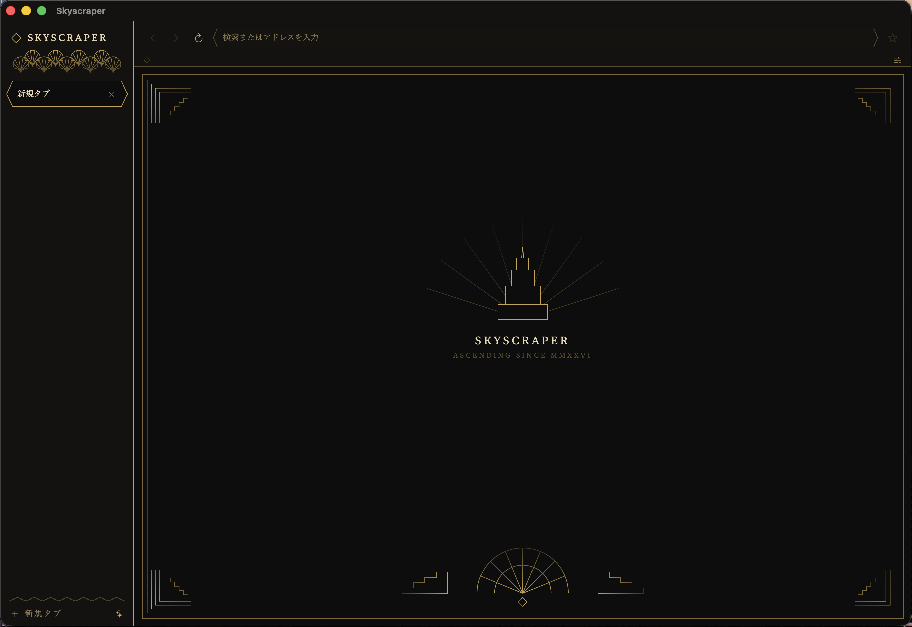

<div align="center">

# SKYSCRAPER

**ASCENDING SINCE MMXXVI**

macOS のための、アール・デコのウェブブラウザです。


[](https://github.com/inugamine/Skyscraper/releases/latest)


[ダウンロード](https://github.com/inugamine/Skyscraper/releases/latest) ・
[サイト](https://www.inugamine.live-on.net/skyscraper)

</div>



---

## これは何か

黒と金でまとめた、1920 年代の摩天楼のようなブラウザです。  
描画には WKWebView (Safari と同じエンジン) を使い、外側の UI はすべて SwiftUI で作っています。

個人が自分のために作っているブラウザなので、広告も、行動の計測も、勝手に話しかけてくる AI も入っていません。

## できること

### 見た目

- 黒と金のアール・デコ。ジグザグの罫線と、扇 (palmette) の意匠
- 六角形の**縦タブ**。数が増えてもタブ名が読めます
- 新規タブページには、階段状に伸びる摩天楼のシルエット

### タブ

- 縦タブとタブグループ。`⌃Tab` `⌃⇧Tab` でグループ順に巡回できます
- 複数ウィンドウに対応。終了時にウィンドウ単位で記憶し、次回そのまま開き直します
- 復元したタブは Safari と同じ**遅延読み込み**です。100 枚あっても起動は一瞬で終わります

### AI によるタブの自動グループ分け

Apple Foundation Models（オンデバイス）でタブの内容を判断し、自動的にまとめます。  
**通信は一切行いません。** タイトルも URL も端末の外には出ません。

### 邪魔なものを止める

| | |
|---|---|
| 広告ブロック | `WKContentRuleList` で約 40 ドメイン。fluct・Geniee・Zucks・nend など国内の広告網にも対応しています |
| YouTube | 再生前の広告を検出して飛ばします |
| ポップアップ | `window.open()` を監視します。ただし**黙って捨てることはしません**。止めたことをお知らせして、その場で開き直せるようにしています（OAuth や決済の window を壊さないためです） |

### 読む

- リーダーモード (Mozilla Readability.js)。読み取れるページでのみボタンが表示されます
- 黒地に金の、目に優しい配色です

### そのほか

- ダウンロード棚 (進捗表示つき、常駐)
- カメラ・マイクのサイトごとの許可
- `mailto:` `tel:` `itms-apps:` などは既定のアプリへ引き渡します (受け取り先をこちらから指定することはしません)
- キャッシュ／Cookie／閲覧データの削除 (`⌘,` の設定画面から)
- 全画面動画、Twitter (自称: X) 向けのシアターモード
- Sparkle による自動更新
- 日本語／英語

### これから

- パスキー(WebAuthn) — Apple のエンタイトルメント審査待ちです

## 動作環境

- macOS 26.5 Tahoe 以降
- Apple Silicon (arm64)

## インストール

[Releases](https://github.com/inugamine/Skyscraper/releases/latest) から `.dmg` をダウンロードし、
Skyscraper を Applications へ移動してください。

Developer ID 署名と Apple の公証を済ませていますので、Gatekeeper に止められることはありません。  
以降の更新は Sparkle が自動的に見つけてきます。

## ソースからビルドする

```sh
git clone https://github.com/inugamine/Skyscraper.git
cd Skyscraper
open Skyscraper.xcodeproj
```

Xcode 26.6 以降が必要です。ご自身の環境でビルドする場合は、
Target → Signing & Capabilities の Team をご自身のものに変更してください。


> [!IMPORTANT]
> フォークして配布する場合は、`Info.plist` の `SUFeedURL` と `SUPublicEDKey` を
> 必ずご自身のものに差し替えてください。
> そのままだと、本家の更新がフォーク側のアプリに降ってきてしまいます。

## 構成

```
Skyscraper/
├── SkyscraperApp.swift     エントリポイント、メニュー、ウィンドウ管理
├── ContentView.swift       本体。タブ・ツールバー・WebView・アール・デコの意匠
├── TabGrouper.swift        Foundation Models によるタブの自動グループ分け
├── AdBlocker.swift         WKContentRuleList の組み立て
├── PopupBlocker.swift      window.open() の監視と許可リスト
├── ExternalScheme.swift    mailto: などを担当アプリへ引き渡す
├── ReaderMode.swift        Readability.js の橋渡し
├── DownloadManager.swift   ダウンロード棚
├── MediaPermission.swift   カメラ・マイクのサイトごとの許可
├── PasskeyManager.swift    WebAuthn (審査待ち)
├── PrivacyManager.swift    閲覧データの削除
├── Updater.swift           Sparkle
└── SettingsView.swift      設定画面
```

## 使用しているもの

- [Sparkle](https://sparkle-project.org/) — 自動更新 (MIT)
- [Readability.js](https://github.com/mozilla/readability) — Mozilla (Apache-2.0)
- Apple Foundation Models / NaturalLanguage / AuthenticationServices

## ライセンス

[Apache License 2.0](LICENSE) です。Copyright 2026 inugamine

改変も再配布も自由ですが、変更した箇所はその旨を明記してください。  
また、このライセンスは「Skyscraper」という名称や意匠の使用を許諾するものではありません (第 6 条)。

同梱している第三者のソフトウェアについては [NOTICE](NOTICE) を参照してください。

---

<div align="center">

**SKYSCRAPER** ・ built by [inugamine](https://github.com/inugamine)

</div>
